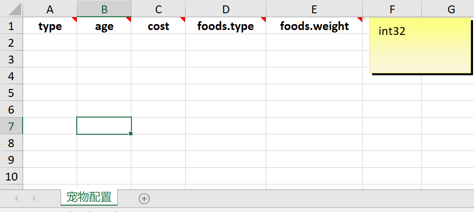
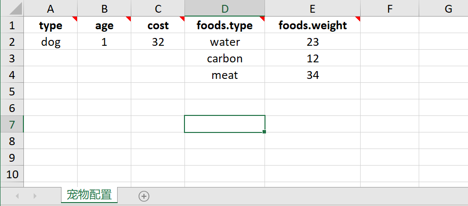

### reskeeper
#### 1. general excel file from proto file
#### 2. convert excel to proto binary 、json 、 txt

### usage:

#### requirement
1. protoc.exe


#### 1.define proto file
- demo.proto
```protobuf

import "resource_opt.proto"; // import the resource option proto
option (res_excel_path) = "../excel/测试样例.xlsx"; // specify the excel to generate
option (res_generate_path) = "../data"; // dir for convert result
option (res_generate_json) = true; // true to generate json format file
option (res_generate_txt) = true; // true to generate txt format file
option (res_generate_tags) = "full"; // tags used to determine convert field or not ,see (res_tag_ignores)
option (res_generate_tags) = "desc";
message PetFood {
  optional string type = 1;
  optional int32 weight = 2;
}
message Pet {
  option (res_tag_ignores) = "desc:3-999"; // pet.desc.json will not contain field 'cost' and 'foods'
  optional string type = 1;
  optional int32 age = 2;
  optional int32 cost = 3;
  repeated PetFood foods = 4;
}
message PetTable {
  option (res_generate_name) = "pet"; //Specify the final generated file prefix. like pet.json
  option (res_sheet_name) = "宠物配置";// specify the excel sheet name 
  repeated Pet pets = 1;
}
```
#### 2.generate excel
run:
```reskeeper.exe -P demos/```

will see `../excel/测试样例.xlsx`

the sheet:


try to edit like:


#### 3.convert excel to binary / json / txt

run:
```reskeeper.exe -P demos/ -C excel/测试样例.xlsx```

convert result will write to `../data`

- ../data/pet.full.json
```json
{
  "pets": [
    {
      "type": "dog",
      "age": 1,
      "cost": 32,
      "foods": [
        {
          "type": "water",
          "weight": 23
        }
        ...
      ]
    }
  ]
}
```
- ../data/pet.desc.json

**because of `option (res_tag_ignores) = "desc:3-999";` ,desc only convert 'type' and 'age' field**
```json
{
  "pets": [
    {
      "type": "dog",
      "age": 1
    }
  ]
}
```


**reskeeper also support comment 、 validate ,see internal demo.proto for more usage**